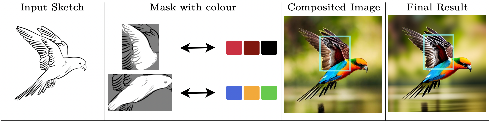

# SketchDeco
Official repo for [SketchDeco: Decorating B&amp;W Sketches with Colour](https://arxiv.org/abs/2405.18716).

See [Project Page](https://chaitron.github.io/SketchDeco/) for more examples.

SketchDeco is a training-free sketch colourisation approach that turns free-hand sketches, masks, and colour palettes into realistic images without user-defined text prompts.

## TODO

- [ ] Release inference code.
