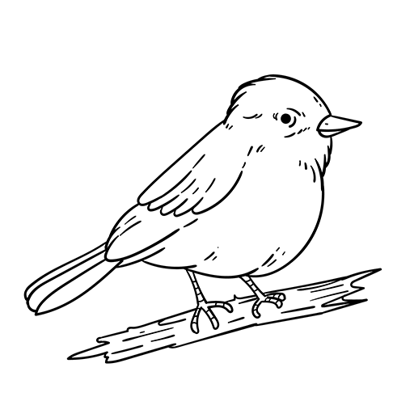
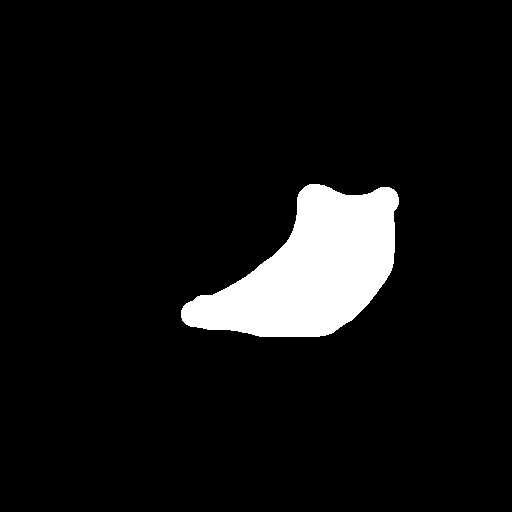
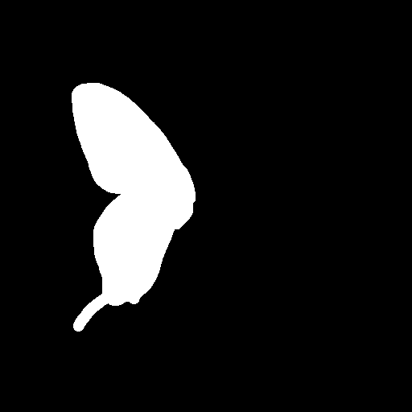
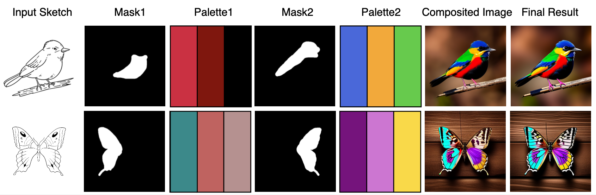
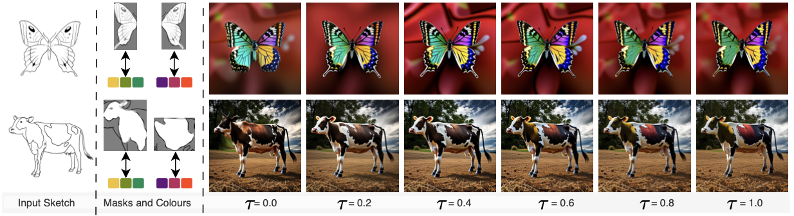

# SketchDeco
Official repo for [SketchDeco: Decorating B&amp;W Sketches with Colour](https://arxiv.org/abs/2405.18716).

See [Project Page](https://chaitron.github.io/SketchDeco/) for more examples.


SketchDeco is a training-free sketch colourisation approach that turns free-hand sketches, masks, and colour palettes into realistic images without user-defined text prompts.

## Prerequisites

Our codebase is tested on Nvidia RTX 4090 Super GPUs and Google Colab A100 instance. A VRAM of 23 GB is recommended, though this may vary depending on the input samples (minimum 20 GB).

### Install Dependencies

```
git clone https://github.com/CHAITron/sketchdeco-code.git
cd sketchdeco-code
pip install -r requirements.txt
```
### Download Model (other models will automatically download)

```
mkdir ckpt
wget -O ckpt/sd-v2-1_512-ema-pruned.ckpt https://huggingface.co/stabilityai/stable-diffusion-2-1-base/resolve/main/v2-1_512-ema-pruned.ckpt?download=true
```

## Sketch, Masks, and Palettes Preparation
We provided two examples in inputs/ folder. In each example, sketch.png is an input sketch with two colourised Region-of-Interests (ROIs) (mask1+palette1 and mask2+palette2).In order to add more ROIs, user can add mask3+palette3, ... . The input data structure is like this:
```
inputs
├── example1
│  ├── sketch.xxx
│  ├── mask1.xxx
│  ├── palette1.xxx
│  ├── mask2.xxx
│  ├── palette2.xxx
│  ├── ...
├── example2
│  ├── sketch.xxx
│  ├── mask1.xxx
│  ├── palette1.xxx
│  ├── mask2.xxx
│  ├── palette2.xxx
│  ├── ...
├── ...
```

### Sketch Preparation
Input Sketch can be any B&W sketch with size 512x512. In the examples, we got them from https://www.freepik.com/:

 

### Mask and Palette Preparation
Since, mask#n and palette#n are linked together, user is expected to add two files (mask+palette) when adding new RoI. For mask, it is binary image shared same resolution with input sketch (512x512).  In our examples, we used **Adobe Photoshop** to create masks using the **Brush** and **Magic Wand** tools. Here are some illustrations of the masks:

 

Colour palette can be described in text file. Each line should contain one colour hex-code:

```
#DC143C
#8B0000
#000000
```

## Running SketchDeco
To execute the SketchDeco, run the following commands:
```
!python main.py  --indir ./inputs     \
                 --outdir ./outputs   \
                 --tau 0.4            \
                 --seed 1284                             
```
P.S. seed is just used for reproducing the following results from inputs/:



Tau value is a scaling factor representing a trade-off between harmonisation and faithfulness. A low τ = 0.0 gives better harmonisation of colours but lacks faithfulness (e.g., missing regions in the wings of ‘butterfly’) whereas a high τ = 1.0 gives highly faithful image generation but lacks sufficient harmonisation of colours (e.g., the red patch on ‘cow’).



## TODO

- [x] Release inference code.
- [ ] Release GUI version.

## Acknowledgments
Our work is built on the amazing achievements of those who came before us. A huge thank you to the brilliant minds who created the foundation for our code: 
[TF-ICON](https://github.com/Shilin-LU/TF-ICON), [Stable-Diffusion](https://github.com/Stability-AI/stablediffusion) and [Prompt-to-Prompt](https://github.com/google/prompt-to-prompt). 


## Citation
If you find the repo useful, please consider citing:
```
@article{utintu2024sketchdeco,
  author    = {Chaitat Utintu and Pinaki Nath Chowdhury and Aneeshan Sain and Subhadeep Koley and Ayan Kumar Bhunia and Yi-Zhe Song},
  title     = {SketchDeco: Decorating B&W Sketches with Colour},
  journal   = {arXiv preprint arXiv:2405.18716},
  year      = {2024},
}
```
